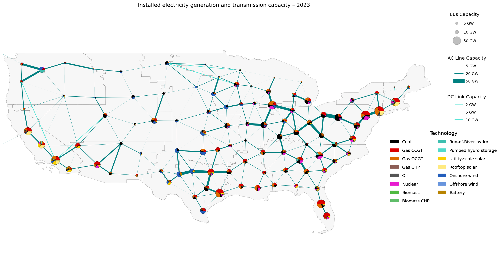

<!--
SPDX-FileCopyrightText:  PyPSA-Earth and PyPSA-Eur Authors

SPDX-License-Identifier: AGPL-3.0-or-later
-->

# PyPSA-Northamerica

## Development Status: **Under development and Active**

[](https://github.com/pypsa-meets-earth/pypsa-northamerica/actions/workflows/test.yml)
[](https://www.gnu.org/licenses/agpl-3.0)
[](https://api.reuse.software/info/github.com/pypsa-meets-earth/pypsa-northamerica)
[](https://discord.gg/AnuJBk23FU)
[](https://zenodo.org/records/20762977)

PyPSA-Northamerica is a North America-focused soft fork of PyPSA-Earth initially developed by Open Energy Transition in the framework of the [Grid modelling to assess electrofuels supply potential](https://www.openenergytransition.org/projects/grid-modelling-to-assess-electrofuels).

PyPSA-Northamerica extends the standard [PyPSA-Earth workflow](https://github.com/pypsa-meets-earth/pypsa-earth) with custom rules and input data for North American energy system modelling, with a current focus on the United States. It is intended as a sector-coupled model with a high spatial (100 nodes) and temporal (3 hours / 1 hour) resolution.



The following countries are currently supported:

🇺🇸 United States

Canada and Mexico may be added in future releases.

## Running the workflow

Scenario configuration files are stored in `configs/custom`. The main configuration file is `configs/custom/config.main.yaml`, while scenario-specific files are available in subfolders such as `configs/calibration/` and `configs/scenarios/`.

### Running US scenarios

All Snakemake commands should be executed from the repository root.

To run the US power model for the selected, calibrated base year (2023):

```bash
snakemake -c 1 solve_all_networks --configfile configs/custom/calibration/config.base.elec.yaml
```

To run the US sector-coupled model for the selected, calibrated base year (2023):

```bash
snakemake -c 1 solve_sector_networks --configfile configs/custom/calibration/config.base.sector.yaml
```

To run a future-year Reference scenario, replace `20**` with the target year:

```bash
snakemake -c 1 solve_all_networks --configfile configs/custom/scenarios/config.20**.yaml
```

For the corresponding sector-coupled model:

```bash
snakemake -c 1 solve_sector_networks --configfile configs/custom/scenarios/config.20**.yaml
```

Future-year configuration files are currently available for 2030, 2035, and 2040.

To run the sector-coupled model across multiple horizons (myopic optimization):

```bash
snakemake -call solve_sector_networks_myopic --configfile configs/custom/scenarios/config.scenario.**.yaml
```

where ** can be replaced with any value from `01` to `10` (scenario descriptions are available in the provided config files).

### Custom workflow

PyPSA-NorthAmerica follows a lightweight soft-fork architecture. Most customizations are implemented through dedicated rules and scripts in `workflow/custom.smk` and `scripts/custom/`. When only minor changes are required, the corresponding upstream PyPSA-Earth scripts are modified directly instead of being duplicated. Such modifications are explicitly marked with `# PyPSA-NorthAmerica` comments to facilitate maintenance and future synchronization with upstream.

The custom workflow is activated through

```yaml
custom_rules:
  - workflow/custom.smk
```

Only the components requiring North American datasets or modelling assumptions are replaced, while the remainder of the workflow is inherited directly from PyPSA-Earth. This minimizes maintenance effort while allowing upstream improvements to be incorporated with minimal changes.

#### Custom rules

| Rule name | Script | Purpose                                                                                                                              |
|---|---|--------------------------------------------------------------------------------------------------------------------------------------|
| `custom_process_cost_data` | `scripts/custom/custom_process_cost_data.py` | Apply technology-group-specific cost scenario overrides during upstream technology cost processing.                                  |
| `process_airport_data` | `scripts/custom/process_airport_data.py` | Process US airport passenger and jet-fuel data.                                                                                      |
| `generate_aviation_scenario` | `scripts/custom/generate_aviation_scenarios.py` | Generate future aviation fuel demand scenarios based on ICCT scenarios.                                                              |
| `modify_aviation_demand` | `scripts/custom/modify_aviation_demand.py` | Replace default aviation demand in `energy_totals`.                                                                                  |
| `preprocess_demand_data` | `scripts/custom/preprocess_demand_data.py` | Preprocess US utility demand data into geospatial inputs.                                                                            |
| `build_demand_profiles_from_eia` | `scripts/custom/build_demand_profiles_from_eia.py` | Build electricity demand profiles from EIA balancing authority data and take precedence over the default demand-profile rule.        |
| `set_saf_mandate` | `scripts/custom/set_saf_mandate.py` | Add e-kerosene buses and SAF mandate constraints when enabled.                                                                       |
| `build_custom_industry_demand` | `scripts/custom/build_custom_industry_demand.py` | Estimate node-level demand for selected custom industries.                                                                           |
| `add_custom_industry` | `scripts/custom/add_industry.py` | Add selected custom industries and point-source CO2 capture to the sector-coupled network.                                           |
| `prepare_growth_rate_scenarios` | `scripts/custom/prepare_growth_rate_scenarios.py` | Select growth-rate files for the configured demand projection scenario.                                                              |
| `set_distribution_fees` | `scripts/custom/set_distribution_fees.py` | Add US distribution-fees to the sector network.                                                                                      |
| `solve_custom_sector_network` | `scripts/custom/solve_custom_sector_network.py` | Solve the customized sector-coupled model with clean electricity, RES policy, hydrogen temporal matching and tax-credit constraints. |

### Custom retrieve rules

PyPSA-Northamerica also includes retrieve rules that allow selected precomputed inputs to be used instead of rebuilding them from scratch.

| Rule name                     | Description                                                             |
| ----------------------------- |-------------------------------------------------------------------------|
| `retrieve_cutouts`            | Retrieve North American cutouts.                                        |
| `retrieve_osm_raw`            | Retrieve raw OSM data and bypasses `download_osm_data`.                 |
| `retrieve_osm_clean`          | Retrieve cleaned OSM data and bypasses `clean_osm_data`.                |
| `retrieve_shapes`             | Retrieve shape files and bypasses `build_shapes`.                       |
| `retrieve_osm_network`        | Retrieve the OSM-based network and bypasses `build_osm_network`.        |
| `retrieve_base_network`       | Retrieve `base.nc` and bypasses `base_network`.                         |
| `retrieve_renewable_profiles` | Retrieve renewable profiles and bypasses `build_renewable_profiles`.    |
| `retrieve_custom_powerplants` | Copy `data/custom_powerplants.csv` into the PyPSA-Earth data directory. |
| `retrieve_ssp2`               | Copy `data/NorthAmerica.csv` into the SSP2 data directory.              |
| `retrieve_demand_data`        | Retrieve utility demand input data.                                     |

### Computational reproducibility

The optimization problems generated by this project become extremely large when high spatial and temporal resolution are used.
In such cases, the computational cost is primarily driven by memory-intensive linear algebra operations required during the barrier matrix factorization of the optimisation problem.

#### Hardware and solver setup

All optimization runs were executed on homogeneous HPC nodes with the following configuration:

- **CPU:** Intel Xeon Gold 6342 (2.80 GHz)
- **Cores:** 48 physical cores (96 logical processors)
- **Operating system:** Debian GNU/Linux 12 (bookworm)

All optimization problems were solved using **Gurobi Optimizer 13.0.0**.

The following solver parameters were used consistently across all runs:

```
Method = 2        # Barrier algorithm
Crossover = 0     # Disable crossover to avoid additional memory and runtime overhead
BarConvTol = 1e-4
BarHomogeneous = 1
Threads = 8
```

No solver parameters were tuned on a per-scenario basis.

#### Problem size

The resulting linear optimisation problems are extremely large. Typical model sizes are:

| Temporal resolution | Rows | Columns | Nonzeros |
|---|---|---|---|
| 3-hour | ~100–150 million | ~50–75 million | ~200–350 million |
| 1-hour | ~280–440 million | ~135–220 million | ~630–1020 million |

Although presolve procedures eliminate a large fraction of constraints and variables, the resulting presolved systems remain extremely large.

#### Memory requirements

Memory requirements are characterized using the **Estimated Factorization Memory (EFM)** reported by the solver.
EFM represents the memory required to store the numerical factorization of the linear system solved at each barrier iteration.

Typical EFM values observed:

| Temporal resolution | Estimated factorization memory |
|---|---|
| 3-hour | ~100–130 GB |
| 1-hour | ~500 GB |

While EFM does not correspond to total solver memory consumption, it provides a good proxy for peak memory requirements because matrix factorization dominates the memory footprint of barrier-based methods.

### Runtime

Typical wall-clock solution times observed in the experiments are:

| Temporal resolution | Runtime (per time horizon)   |
|---|------------------------------|
| 3-hour | ~1–3 days (typically 2 days) |
| 1-hour | ~7–12 days                   |

Solver logs indicate that **85–95% of runtime is spent in repeated linear solves during barrier iterations**, while presolve, matrix ordering and other overheads account for only a small fraction of total runtime.

#### Implications for temporal resolution

The **3-hour temporal resolution** used in the main analysis represents a trade-off between temporal detail and computational feasibility.

At **1-hour resolution**, the base-year optimization alone requires approximately one week of runtime and around **500 GB of factorization memory**, making multi-scenario analyses computationally very expensive.
The 3-hour resolution significantly reduces both runtime and memory requirements while preserving the main temporal dynamics relevant for the analysis.

## Collaborators

PyPSA-NorthAmerica builds on the PyPSA-Earth-based model developed in the framework of the [Grid modelling to assess electrofuels supply potential](https://github.com/open-energy-transition/efuels-supply-potentials) project by:

<table>
<tr>

<td align="center">
<a href="https://github.com/danielelerede-oet">

<br>
<sub><b>Daniele Lerede</b></sub>
</a>
</td>

<td align="center">
<a href="https://github.com/yerbol-akhmetov">

<br>
<sub><b>Yerbol Akhmetov</b></sub>
</a>
</td>

<td align="center">
<a href="https://github.com/GbotemiB">

<br>
<sub><b>Emmanuel Gbotemi</b></sub>
</a>
</td>

<td align="center">
<a href="https://github.com/hazemakhalek">

<br>
<sub><b>Hazem Akhalek</b></sub>
</a>
</td>

<td align="center">
<a href="https://github.com/SermishaNarayana">

<br>
<sub><b>Sermisha Narayana</b></sub>
</a>
</td>

</tr>
</table>
